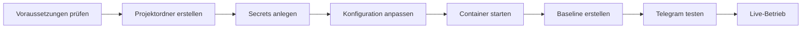

# 🚀 SlopCoin v1.0 — Komplette Installationsanleitung

**Von 0 bis Live in unter 30 Minuten**

**Version:** v1.0
**Stand:** 2026-02-27

---

## 📖 Inhaltsverzeichnis

1. [Was macht SlopCoin?](#was-macht-SlopCoin)
2. [Voraussetzungen](#voraussetzungen)
3. [Übersicht: Der Installationsprozess](#übersicht-der-installationsprozess)
4. [Schritt 1: Projektordner vorbereiten](#schritt-1-projektordner-vorbereiten)
5. [Schritt 2: Secrets anlegen](#schritt-2-secrets-anlegen)
6. [Schritt 3: Konfiguration anpassen](#schritt-3-konfiguration-anpassen)
7. [Schritt 4: Container starten](#schritt-4-container-starten)
8. [Schritt 5: Erste Schritte & Testing](#schritt-5-erste-schritte--testing)
9. [Telegram-Befehle im Detail](#telegram-befehle-im-detail)
10. [Erweiterte Konfiguration](#erweiterte-konfiguration)
11. [Wartung & Betrieb](#wartung--betrieb)
12. [Troubleshooting](#troubleshooting)
13. [Sicherheits-Checkliste](#sicherheits-checkliste)
14. [Monitoring & Performance](#monitoring--performance)
15. [Backup & Recovery](#backup--recovery)
16. [Häufige Fragen (FAQ)](#häufige-fragen-faq)
17. [Features in v1.0](#features-in-v10)

---

## Was macht SlopCoin?

**SlopCoin v1.0** ist dein persönlicher, KI-gestützter Krypto-Portfolio-Advisor für Kraken. Er überwacht dein Portfolio 24/7 und sendet dir **nur dann** Empfehlungen per Telegram, wenn wirklich Handlungsbedarf besteht.

### Die 4 Kernfunktionen

1. **Portfolio-Überwachung**: Automatisches Tracking aller deiner Kraken-Balances
2. **KI-Analyse**: Intelligente Bewertung mit technischen Indikatoren und Risikoanalyse
3. **Telegram-Integration**: Sofortige Benachrichtigungen und Steuerung per Chat
4. **Zeitmanagement**: Konfigurierbares Analyse-Fenster (keine Nachrichten nachts)

### Was SlopCoin NICHT tut

- ❌ **Kein automatischer Handel**: SlopCoin kann **nur lesen**, nicht kaufen oder verkaufen
- ❌ **Keine Trade-Rechte**: Dein Kraken API Key sollte nur Read-Only haben
- ❌ **Kein Spam**: Der Bot meldet sich **nur** bei relevanten Signalen
- ❌ **Keine Nachrichten nachts**: Außerhalb deines Analyse-Fensters ist Ruhe

---

## Voraussetzungen

### Hardware & Software

- [ ] **Synology NAS** (oder jeder Docker-fähige Server)
  - Docker Package installiert
  - SSH-Zugang aktiviert (für Initial-Setup)
- [ ] **Internet-Verbindung** (stable, für API-Aufrufe)
- [ ] **Mindestens 500 MB freier Speicher** (für Container und Caching)

### Accounts & API Keys

- [ ] **Kraken Account** mit API Key (Read-Only)
- [ ] **Telegram Account** + Bot Token von @BotFather
- [ ] **AI Hub Zugang** (OpenAI-kompatible API, z.B. OpenRouter, Azure OpenAI, oder selbst gehostet)

### Technisches Verständnis

- Grundkenntnisse in Docker und Docker-Compose
- Grundkenntnisse in Terminal/SSH (für Synology)
- Verständnis von API Keys und Secrets

---

## Übersicht: Der Installationsprozess



**Gesamtdauer**: 20-30 Minuten (abhängig von Vorerfahrung)

---

## Schritt 1: Projektordner vorbereiten

### 1.1 Ordnerstruktur erstellen

1. **SSH auf dein NAS** öffnen (z.B. mit PuTTY oder Terminal)
2. **Zum Docker-Verzeichnis navigieren**:
   ```bash
   cd /volume1/docker/
   ```
3. **SlopCoin-Ordner erstellen**:
   ```bash
   mkdir SlopCoin
   cd SlopCoin
   ```
4. **Verzeichnisstruktur anlegen**:
   ```bash
   mkdir -p src/prompts
   mkdir -p secrets
   mkdir -p /tmp_docker  # Wird vom Container automatisch genutzt
   ```

### 1.2 Dateien kopieren

Kopiere alle Dateien aus diesem Projekt in den neu erstellten Ordner:

```
/volume1/docker/SlopCoin/
├── docker-compose.yml
├── Dockerfile
├── requirements.txt
├── src/
│   ├── main.py
│   ├── config.py
│   ├── data_fetcher.py
│   ├── portfolio_tracker.py
│   ├── risk_analyzer.py
│   ├── llm_engine.py
│   └── prompts/
│       ├── 1_analyst.j2
│       ├── 2_guardian.j2
│       ├── 3_next_invest.j2
│       └── 4_weekly_summary.j2
└── secrets/  # Wird in Schritt 2 angelegt
```

**Tipp**: Du kannst die Dateien auch über DSM File Station hochladen, wenn du kein SSH magst.

### 1.3 Rechte setzen (wichtig!)

```bash
# Sicherstellen, dass der Docker-Container lesen kann
chmod -R 755 /volume1/docker/SlopCoin/
chmod -R 700 /volume1/docker/SlopCoin/secrets
```

---

## Schritt 2: Secrets anlegen

Die `secrets/`-Ordner enthält deine sensiblen API-Keys. **Nie** diese Dateien in Git committen!

### 2.1 Telegram Bot Token besorgen

1. **@BotFather** auf Telegram suchen und starten
2. **`/newbot`** eingeben
3. Bot-Namen wählen (z.B. "SlopCoin Advisor")
4. Bot-Username wählen (z.B. "SlopCoinAdvisorBot")
5. **Token kopieren** (Format: `123456789:ABCdefGHIjklMNOpqrsTUVwxyz`)

### 2.2 Kraken API Key erstellen

1. **In Kraken einloggen** → Security → API
2. **Neuen API Key erstellen**
3. **Berechtigungen**:
   - ✅ **Query Funds** (Balance abfragen)
   - ✅ **Query Orders** (optional, für erweiterte Features)
   - ❌ **Create/Cancel Orders** (NICHT aktivieren!)
   - ❌ **Withdraw** (NICHT aktivieren!)
4. **Key & Secret kopieren** (wird nur einmal angezeigt!)

### 2.3 AI Hub API Key besorgen

Je nach Anbieter:
- **OpenRouter**: https://openrouter.ai/ → API Keys
- **Azure OpenAI**: Azure Portal → OpenAI Ressource → Keys
- **Andere**: API-Key von deinem Provider

### 2.4 Secrets-Dateien erstellen

```bash
cd /volume1/docker/SlopCoin/secrets
```

#### Datei 1: `telegram_token.txt`
```bash
echo "123456789:ABCdefGHIjklMNOpqrsTUVwxyz" > telegram_token.txt
```

#### Datei 2: `kraken_api.json`
```bash
cat > kraken_api.json << 'EOF'
{
  "key": "dein-kraken-api-key",
  "secret": "dein-kraken-api-secret"
}
EOF
```

#### Datei 3: `ai_hub_key.txt`
```bash
echo "dein-ai-hub-api-key" > ai_hub_key.txt
```

### 2.5 Rechte sperren (kritisch!)

```bash
chmod 600 /volume1/docker/SlopCoin/secrets/*
```

**Warum?** Docker und der Bot laufen als Non-Root und benötigen Leserechte. `chmod 600` stellt sicher, dass nur der Besitzer lesen/schreiben kann.

---

## Schritt 3: Konfiguration anpassen

### 3.1 `docker-compose.yml` öffnen

```bash
cd /volume1/docker/SlopCoin
nano docker-compose.yml
# Oder über DSM File Station
```

### 3.2 Wichtige Variablen anpassen

#### AI Hub Konfiguration

```yaml
environment:
  - AI_BASE_URL=https://dein-ai-hub.de/v1
  - AI_MODEL_NAME=claude-opus-4-6       # Analyst: maximale Qualität
  - AI_MODEL_GUARDIAN=claude-sonnet-4-6  # Guardian: stark + günstiger
```

**Erklärungen:**
- `AI_BASE_URL`: Dein AI Hub Endpoint (z.B. `https://openrouter.ai/api/v1` oder `https://api.openai.com/v1`)
- `AI_MODEL_NAME`: Das Analyst-Modell (Deep-Analysis, 1x/Tag)
- `AI_MODEL_GUARDIAN`: Das Guardian-Modell (Validierung der Analyst-Empfehlung)

#### Telegram Konfiguration

```yaml
environment:
  - ALLOWED_TELEGRAM_USER_ID=123456789
```

**Erklärungen:**
- `ALLOWED_TELEGRAM_USER_ID`: Deine eigene Telegram User-ID (von @userinfobot)

#### Analyse-Fenster

```yaml
environment:
  - ANALYSIS_START_HOUR=8   # 08:00 Uhr
  - ANALYSIS_END_HOUR=22    # Bis 22:00 Uhr
```

**Erklärungen:**
- Der Bot führt nur in diesem Zeitfenster Analysen durch und sendet Nachrichten
- Außerhalb (z.B. 22:00-08:00) ist Ruhezeit – keine Nachrichten
- Zeitzone: Systemzeitzone des NAS (z.B. Europe/Berlin)

#### Zeitzone

```yaml
environment:
  - TZ=Europe/Berlin
```

**Wichtig**: Stelle sicher, dass die Zeitzone deines NAS korrekt eingestellt ist (DSM → System → Zeitzone).

### 3.3 Analyse-Architektur: Hybrid-Ansatz

SlopCoin nutzt einen **dreistufigen Hybrid-Ansatz** für maximale Qualität bei minimalen Kosten:

```
┌──────────────────────────────────────────────────────────────────────────┐
│  1x täglich (08–22 Uhr)    Alle 30 Minuten    1x wöchentlich (So 10:00) │
│  ──────────────────────    ───────────────    ──────────────────────────  │
│  🤖 KI-Deep-Analysis       ⚡ Preis-Alert     📊 Weekly Summary           │
│  • claude-opus-4-6         • Kein LLM-Call   • claude-opus-4-6           │
│    (Analyst + Web-Search)  • Nur Mathematik  • Kein Guardian             │
│  • claude-sonnet-4-6       • Kostenlos       • Immer gesendet            │
│    (Guardian-Validierung)  • Sofort-Alert    • Auch bei HOLD             │
│  • NUR bei Signal senden   • +20% / -15%     • Wochenrückblick           │
│  • HOLD → keine Nachricht                    • + Ausblick                │
└──────────────────────────────────────────────────────────────────────────┘
```

**Warum dieser Ansatz?**
- **Tägliche Analyse (nur bei Signal):** Krypto-Märkte brauchen **Kontext**, nicht nur Zahlen. `claude-opus-4-6` mit Web-Search liefert bessere Entscheidungen als 6x ein schwaches Modell. Bei HOLD → keine Nachricht, kein Spam.
- **Preis-Alerts (kostenlos):** Fangen intraday Bewegungen ab — sofort, ohne LLM-Kosten.
- **Weekly Summary (immer):** Jeden Sonntag ein vollständiger Wochenrückblick — auch wenn die Woche ruhig war. Kein Guardian → ~50% günstiger als tägliche Analyse.

### 3.4 Modell-Auswahl Tabelle

Nur Modelle mit **Web-Search / Agentic-Fähigkeit** sind gelistet. Modelle ohne diese Fähigkeit (reine Text-Modelle, Embedding-Modelle) sind für SlopCoin nicht geeignet.

**Preise Stand: Feb 2026 — Alle Modelle EU-hosted verfügbar**

| Modell | Provider | Input /1M Tokens | Output /1M Tokens | Kosten/Monat* | Web-Search | Empfehlung |
|--------|----------|-----------------|-------------------|---------------|------------|------------|
| `gpt-4.1-nano` | Azure | $0.11 | $0.44 | ~$0.04 | ✅ | 💚 Extrem günstig |
| `gemini-2.5-flash` | Google | $0.30 | $2.50 | ~$0.09 | ✅ nativ | 💚 Sehr günstig, nativ Search |
| `gpt-4o-mini` | Azure | $0.17 | $0.66 | ~$0.07 | ✅ | 💚 Günstig |
| `gpt-4.1-mini` | Azure | $0.44 | $1.76 | ~$0.18 | ✅ | 💛 Gut |
| `claude-haiku-4-5` | Google | $1.00 | $5.00 | ~$0.42 | ✅ | 💛 Gut |
| `gemini-2.5-pro` | Google | $1.25 | $10.00 | ~$0.62 | ✅ nativ | 💛 Stark, nativ Search |
| `gpt-4.1` | Azure | $2.20 | $8.80 | ~$0.88 | ✅ | 🔴 Teuer |
| `claude-sonnet-4-6` | Google | $3.00 | $15.00 | ~$1.29 | ✅ | 🟡 **Guardian** ← Standard |
| `gpt-4o` | Azure | $2.75 | $11.00 | ~$1.16 | ✅ | 🔴 Premium |
| `claude-opus-4-6` | Google | $5.00 | $25.00 | ~$2.15 | ✅ | 🟡 **Analyst** ← Standard |

\* Tägliche Analyse: ~3.000 Input + 800 Output Tokens, nur bei Signal (selten). Weekly Summary: 4x/Monat, ~3.000 Input + 1.200 Output Tokens, kein Guardian.

> ℹ️ **Nicht gelistet** (kein Web-Search / nicht agentic): `llama-3-3-70b-sovereign`, `google/gemma-3-27b-it`, `intfloat/e5-mistral-7b-instruct` (Embedding), `text-embedding-3-large` (Embedding), `gpt-oss-120b-sovereign`

**Standard-Konfiguration (maximale Qualität, ~$1.35/Monat):** ✅ Aktuelle Einstellung
- **Analyst (täglich, nur bei Signal)**: `claude-opus-4-6` — tiefste Reasoning-Qualität für Marktanalyse + Web-Search
- **Guardian (täglich, nur bei Signal)**: `claude-sonnet-4-6` — stark genug für Validierung, günstiger als Opus
- **Weekly Summary (1x/Woche, immer)**: `claude-opus-4-6` — kein Guardian, direkt gesendet
- **Preis-Alerts**: Kein LLM (kostenlos, alle 30 Min)

**Budget-Konfiguration (~$0.20/Monat):**
- **Analyst**: `gemini-2.5-flash` — nativ Web-Search, sehr günstig
- **Guardian**: `gpt-4.1-nano` — günstigste Validierung
- **Weekly Summary**: `gemini-2.5-flash` — kein Guardian

### 3.5 Volumes und tmpfs prüfen

Die `docker-compose.yml` sollte folgende Volumes und tmpfs-Einträge haben:

```yaml
volumes:
  - ./src:/app/src:ro         # Code: Read-Only
  - ./secrets:/app/secrets:ro # Secrets: Read-Only

tmpfs:
  - /tmp:size=100M,mode=1777
  - /var/tmp:size=50M,mode=1777
  - /tmp_docker:size=200M,mode=755
```

**Wichtig**: `/tmp_docker` wird als In-Memory-Dateisystem (tmpfs) gemountet. Dort speichert SlopCoin Baseline, Performance-Historie und Cache. Diese Daten gehen beim Container-Neustart verloren — das ist gewollt (frischer Start).

---

## Schritt 4: Container starten

### 4.1 Docker-Compose ausführen

```bash
cd /volume1/docker/SlopCoin
docker-compose up -d --build
```

**Erklärungen:**
- `up`: Container starten
- `-d`: Detached (im Hintergrund)
- `--build`: Image neu bauen (nötig bei Änderungen an Dockerfile/requirements)

### 4.2 Container-Status prüfen

```bash
docker ps | grep SlopCoin
```

Erwartete Ausgabe:
```
CONTAINER ID   IMAGE          COMMAND                  CREATED        STATUS        PORTS     NAMES
abc123...      SlopCoin_...   "python src/main.py"     2 minutes ago  Up 2 minutes             SlopCoin_advisor
```

### 4.3 Logs ansehen (wichtig!)

```bash
docker logs -f SlopCoin_advisor
```

**Erwartete Logs beim ersten Start:**
```
INFO - Initialisiere Komponenten…
INFO - Markets geladen: 200 verfügbar
INFO - Brain connected to https://dein-ai-hub.de/v1 using claude-opus-4-6 (Analyst) / claude-sonnet-4-6 (Guardian)
INFO - Alle Komponenten initialisiert
INFO - SlopCoin v0.1.0 startet – Telegram-Befehle: /status, /pause, /resume, /help
INFO - 🚀 SlopCoin v0.1.0 startet...
INFO - Baseline erstellt: Portfolio-Wert XXX.XX EUR
```

### 4.4 Fehlerbehebung beim Start

| Fehler | Ursache | Lösung |
|--------|---------|--------|
| `API Key fehlt` | `secrets/` nicht korrekt | Prüfe Pfad und Dateinamen |
| `Telegram Token ungültig` | Falscher Token | Neu von @BotFather anfordern |
| `Port already in use` | Port-Konflikt | In `docker-compose.yml` anderen Port wählen |
| `Permission denied` | Rechte zu restriktiv | `chmod 755` auf Ordner, `chmod 600` auf Secrets |

---

## Schritt 5: Erste Schritte & Testing

### 5.1 Baseline-Erstellung abwarten

Beim **ersten Start** erstellt SlopCoin automatisch eine Baseline (Momentaufnahme deines Portfolios). Dies dauert 1-2 Minuten.

Du erhältst eine Telegram-Nachricht:
```
SlopCoin v0.1.0 gestartet

Baseline erstellt: Portfolio-Wert 100.00 EUR

Performance-Tracking startet beim nächsten Lauf.
```

**Was ist eine Baseline?**
- Eine "Start-Messung" deines Portfolios
- Alle zukünftigen Analysen vergleichen mit diesem Wert
- Ermöglicht ROI-Berechnung (Gewinn/Verlust)

### 5.2 Ersten Analyse-Zyklus starten

Standardmäßig läuft der Bot **1x täglich** (um 08:00 Uhr). Um sofort zu testen:

**Option A: Container neu starten** (löst sofortigen ersten Zyklus aus)
```bash
docker-compose restart SlopCoin_advisor
```

**Option B: Warten** (erster Zyklus nach 10 Minuten, dann 1x täglich im Analyse-Fenster)

### 5.3 `/status` Befehl testen

Öffne Telegram und sende an deinen Bot:
```
/status
```

**Erwartete Antwort:**
```
Portfolio-Status (Stand: 13.02.2026 14:30)

Gesamtwert: 125.50 EUR

ROI (vs. Baseline): +25.50%

Bester Performer: BTC (+35.20%)
Schlechtester Performer: ETH (-5.10%)

Positionen:
• BTC: 0.1234 ≈ 100.00 EUR (79.7%)
• ETH: 1.5678 ≈ 25.50 EUR (20.3%)
```

### 5.4 Analyse-Fenster testen

Wenn du **jetzt** außerhalb des Analyse-Fensters bist (z.B. 23:00), wird der Bot keine Nachrichten senden. Du kannst:

1. **`/status`** trotzdem nutzen (manuelle Abfrage)
2. **Analyse-Fenster anpassen** in `docker-compose.yml` (z.B. auf 0-24 setzen für 24/7)
3. **Warten** bis zum nächsten Analyse-Fenster

### 5.5 `/pause` und `/resume` testen

```
/pause
```
Antwort: "Automatische Analyse ist *pausiert*. Du bekommst keine geplanten Abfragen mehr."

```
/resume
```
Antwort: "Automatische Analyse läuft wieder. Du bekommst wie gewohnt Empfehlungen."

**Teste es!** Pausiere den Bot, warte 5 Minuten, und prüfe die Logs – es sollte kein Analyse-Zyklus gestartet werden.

---

## Telegram-Befehle im Detail

### `/status`

Zeigt den aktuellen Portfolio-Status **ohne KI-Analyse** (nur Daten).

**Was wird angezeigt:**
- Gesamtwert in EUR
- ROI vs. Baseline (in %)
- Bester und schlechtester Performer
- Alle Positionen mit Betrag und %-Anteil
- Timestamp

**Wann nutzen?**
- Schnell den aktuellen Stand checken
- Ohne KI-Kosten (kein API-Call zum AI Hub)
- Zwischen den automatischen Analysen

**Beispiel-Ausgabe:**
```
Portfolio-Status (Stand: 27.02.2026 15:45)

Gesamtwert: 150.75 EUR
ROI (vs. Baseline): +50.75%

Bester Performer: SOL (+120.30%)
Schlechtester Performer: DOGE (-15.20%)

Positionen:
• SOL: 2.5678 ≈ 100.00 EUR (66.3%)
• BTC: 0.0056 ≈ 30.00 EUR (19.9%)
• ETH: 0.1234 ≈ 20.75 EUR (13.8%)
```

### `/pause`

Pausiert die automatische Analyse.

**Was passiert?**
- Keine geplanten täglichen Analysen mehr
- Keine automatischen Nachrichten
- Manuelle `/status` funktioniert weiterhin
- Baseline bleibt erhalten

**Wann nutzen?**
- Im Urlaub
- Bei volatilen Märkten (keine Alerts erwünscht)
- Wartungsarbeiten

**Beispiel:**
```
/pause
```
Antwort: "Automatische Analyse ist *pausiert*. Du bekommst keine geplanten Abfragen mehr. Mit /resume wieder starten."

### `/resume`

Setzt die automatische Analyse fort.

**Was passiert?**
- Nächster geplanter Zyklus läuft wieder (innerhalb Analyse-Fenster)
- Baseline bleibt erhalten
- Performance-Tracking wird fortgesetzt

**Beispiel:**
```
/resume
```
Antwort: "Automatische Analyse läuft wieder. Du bekommst wie gewohnt Empfehlungen im Analyse-Fenster."

### `/next <EUR-Betrag>`

Gibt eine KI-gestützte Investment-Empfehlung für einen neuen EUR-Betrag.

**Was passiert intern:**
1. Portfolio, Preise und technische Indikatoren werden geladen
2. Markt-Übersicht (Top-20 Coins) wird abgerufen
3. Analyst-KI analysiert mit Web-Search aktuelle Chancen
4. Guardian validiert die Empfehlung auf Plausibilität
5. Du erhältst eine konkrete Aufteilung mit Begründung

**Die KI entscheidet selbst** wie viele Splits sinnvoll sind und warum – basierend auf Betrag, Marktlage und Portfolio-Kontext.

**Beispiele:**
```
/next 50
```
Mögliche Antwort: "Steck alles in SOL – RSI 28, überverkauft, bullishes MACD-Crossover"

```
/next 500
```
Mögliche Antwort: 3 Splits à ~167 EUR in BTC, ETH, SOL mit individuellen Begründungen

```
/next 5000
```
Mögliche Antwort: 5 Splits à 1.000 EUR für breite Diversifikation

**Beispiel-Ausgabe:**
```
💰 Next Investment: 500,00 EUR

📊 Empfohlene Aufteilung (3 Splits):

1. BTC – 200 EUR (40%)
   ↳ RSI 42, Momentum bullish, starke ETF-Zuflüsse
   ↳ Risiko: niedrig

2. SOL – 200 EUR (40%)
   ↳ RSI 31 (überverkauft), MACD bullish Crossover
   ↳ Risiko: mittel

3. LINK – 100 EUR (20%)
   ↳ Untergewichtet im Portfolio, Chainlink-Partnerschaft
   ↳ Risiko: mittel

🎯 Strategie: DIP_BUYING
💡 Begründung: Bei 500 EUR sind 3 Splits sinnvoll – genug für Diversifikation,
   aber jeder Split bleibt handelbar. Fokus auf überverkaufte Coins mit
   bullishem Momentum.

🌐 Quellen: CoinDesk, CoinTelegraph
⚠️ Keine Finanzberatung – eigene Due Diligence erforderlich.
```

**Wann nutzen?**
- Wenn du frisches Kapital investieren möchtest
- Für eine zweite Meinung vor einem Kauf
- Um Marktchancen schnell zu identifizieren

**Kosten**: Wie eine reguläre Analyse (Analyst + Guardian, ~$0.11 pro Aufruf bei Premium-Modellen)

### `/help`

Zeigt diese Befehlsübersicht.

**Beispiel:**
```
/help
```
Antwort:
```
SlopCoin v0.1.0 – Befehle

/status – Aktuellen Portfolio-Status abrufen
/dashboard – Visuelle Portfolio-Allokation
/heatmap – Korrelationsmatrix
/what_if <COIN> <+/-%> – Szenario-Analyse
/next <EUR> – Investment-Empfehlung für neuen Betrag
/pause – Automatische Analyse pausieren
/resume – Automatische Analyse wieder starten
/help – Diese Hilfe anzeigen

Hinweis: Nachrichten werden nur zwischen 08:00 und 22:00 gesendet (konfigurierbar).
```

---

## Erweiterte Konfiguration

### Caching optimieren

Das Caching-System speichert API-Antworten zwischen und spart ~70% der API-Kosten.

**Cache-Verzeichnis prüfen:**
```bash
docker exec SlopCoin_advisor ls -la /tmp_docker/cache/
```

**Cache-TTLs (in `data_fetcher.py`):**
- `PRICE_CACHE_TTL = 300` (5 Minuten)
- `INDICATOR_CACHE_TTL = 3600` (1 Stunde)
- `PORTFOLIO_CACHE_TTL = 120` (2 Minuten)

**Anpassen?** In der Regel nicht nötig. Die Defaults sind optimiert.

### Modell-Performance testen

Du kannst verschiedene Modelle testen und die Kosten/Performance vergleichen.

**Test-Setup:**
1. Ändere `AI_MODEL_ANALYSIS` in `docker-compose.yml`
2. Container neu starten: `docker-compose up -d --build`
3. Warte auf den nächsten Analyse-Zyklus
4. Prüfe Logs: `docker logs SlopCoin_advisor | grep "Analyst denkt nach"`

**Kosten-Tracking:**
```bash
# API-Kosten in Logs suchen (falls implementiert)
docker logs SlopCoin_advisor | grep "cost"
```

### Analyse-Fenster anpassen

**Beispiele:**

| Szenario | Konfiguration | Erklärung |
|----------|---------------|-----------|
| Standard | `8` bis `22` | 08:00-22:00, nachts ruhe |
| 24/7 | `0` bis `24` | Keine Einschränkung |
| Nachteule | `22` bis `8` | 22:00-08:00 (über Mitternacht) |
| Nur Wochenende | `0` bis `24` + `SCHEDULE_INTERVAL_HOURS=168` | 1x/Woche (Weekly Summary ist besser geeignet) |

**Ändern:**
```yaml
environment:
  - ANALYSIS_START_HOUR=6   # 06:00 Uhr
  - ANALYSIS_END_HOUR=23    # Bis 23:00 Uhr
```

### Intervall ändern

Standard: **1x täglich** (`SCHEDULE_INTERVAL_HOURS=24`)

**Optionen:**
- `1`: Stündlich (mehr Analysen, deutlich höhere Kosten)
- `4`: Alle 4 Stunden
- `6`: Alle 6 Stunden
- `12`: 2x/Tag
- `24`: 1x/Tag ← Standard (empfohlen)

**Ändern:**
```yaml
environment:
  - SCHEDULE_INTERVAL_HOURS=6
```

**Wichtig**: Nach Änderung Container neu starten!

---

## Wartung & Betrieb

### Logs ansehen

**Live-Logs (empfohlen für Debugging):**
```bash
docker logs -f SlopCoin_advisor
```

**Letzte 100 Zeilen:**
```bash
docker logs --tail 100 SlopCoin_advisor
```

**Logs mit Timestamps:**
```bash
docker logs -f --timestamps SlopCoin_advisor
```

**Logs in Datei exportieren:**
```bash
docker logs SlopCoin_advisor > SlopCoin_logs_$(date +%Y%m%d_%H%M%S).txt
```

### Container Management

**Neustart:**
```bash
docker-compose restart
```

**Stoppen:**
```bash
docker-compose stop
```

**Starten (nach Stop):**
```bash
docker-compose start
```

**Neu bauen (bei Code-Updates):**
```bash
docker-compose up -d --build
```

**Löschen (Vorsicht! Verliert Cache und Logs):**
```bash
docker-compose down
# Mit Volumes (löscht auch Baseline und Historie!):
docker-compose down -v
```

### Updates durchführen

1. **Code aktualisieren** (neue Version aus Git/Download)
2. **Secrets prüfen** (unverändert lassen!)
3. **Container neu bauen**:
   ```bash
   docker-compose up -d --build
   ```
4. **Logs prüfen**:
   ```bash
   docker logs -f SlopCoin_advisor
   ```

### Performance überwachen

**Container-Ressourcen:**
```bash
docker stats SlopCoin_advisor
```

**Erwartete Werte:**
- CPU: 0-5% (zwischen Analysen)
- Memory: 200-500 MB
- Network: Minimal (nur API-Calls)

**Bei hoher CPU**: Prüfe, ob Caching funktioniert (`/tmp_docker/cache/`)

---

## Troubleshooting

### Problem: "API Key fehlt" in Logs

**Ursache**: Secrets-Dateien nicht gefunden oder falscher Pfad.

**Lösung:**
1. Prüfe, dass `secrets/` im Projektordner existiert
2. Prüfe Dateinamen: `ai_hub_key.txt`, `kraken_api.json`, `telegram_token.txt`
3. Prüfe Rechte: `chmod 600 secrets/*`
4. Prüfe `docker-compose.yml`: Volume-Mapping korrekt? (`./secrets:/app/secrets:ro`)

### Problem: Keine Telegram-Nachrichten

**Mögliche Ursachen:**

1. **Außerhalb Analyse-Fenster**
   - Prüfe `ANALYSIS_START_HOUR` und `ANALYSIS_END_HOUR`
   - Prüfe Systemzeitzone (`TZ=Europe/Berlin`)
   - Logs: "Zyklus übersprungen: außerhalb des Analyse-Fensters"

2. **Bot pausiert**
   - Sende `/resume` in Telegram
   - Prüfe Pause-State-Datei: `docker exec SlopCoin_advisor cat /tmp_docker/SlopCoin_paused.json`

3. **Kein Handlungsbedarf**
   - SlopCoin sendet **nur** bei relevanten Signalen
   - Portfolio stabil? Dann keine Nachrichten
   - Teste mit `/status` (funktioniert immer)

4. **Falsche User-ID**
   - Prüfe `ALLOWED_TELEGRAM_USER_ID` in `docker-compose.yml`
   - Hole deine User-ID von @userinfobot
   - Logs: "Du bist nicht berechtigt" → ID falsch

### Problem: Hohe API-Kosten

**Ursache**: Caching deaktiviert oder ineffizient.

**Lösung:**
1. Prüfe Cache-Verzeichnis:
   ```bash
   docker exec SlopCoin_advisor ls -la /tmp_docker/cache/
   ```
   Sollte viele `.json` Dateien enthalten.

2. **Cache-TTLs optimieren** (in `data_fetcher.py`):
   - Preise: 300 Sekunden (5 min)
   - Indikatoren: 3600 Sekunden (1 h)
   - Portfolio: 120 Sekunden (2 min)

3. **Modell-Auswahl**:
   - Budget: `gemini-2.5-flash` (Analyst) + `gpt-4.1-nano` (Guardian) = ~$0.13/Monat
   - Standard: `claude-opus-4-6` (Analyst) + `claude-sonnet-4-6` (Guardian) = ~$3.44/Monat

4. **Analyse-Fenster** reduzieren (weniger Zyklen)

### Problem: Container startet nicht

**Diagnose:**
```bash
docker logs SlopCoin_advisor
docker ps -a | grep SlopCoin
docker-compose logs
```

**Häufige Fehler:**

| Fehler | Lösung |
|--------|--------|
| `Port already in use` | In `docker-compose.yml` anderen Port wählen (z.B. `8080:8080` → `8081:8080`) |
| `Permission denied` | `chmod 755` auf Projektordner, `chmod 600` auf Secrets |
| `No space left on device` | Speicherplatz auf NAS prüfen (`df -h`) |
| `Image not found` | `docker-compose pull` oder `--build` verwenden |

### Problem: Kraken API Fehler

**Ursachen:**
- API Key nicht Read-Only (hat Trade-Rechte)
- API Key/Secret falsch
- Kraken Server überlastet (Rate Limit)

**Lösung:**
1. **API Key prüfen**: In Kraken → API → Key Properties
   - Nur "Query Funds" und "Query Orders" aktiviert
2. **Secrets prüfen**: JSON-Format korrekt?
   ```json
   {"key": "...", "secret": "..."}
   ```
3. **Rate Limit**: SlopCoin hat `enableRateLimit=True`, aber zu viele Zyklen können trotzdem limitieren
   - Intervall erhöhen (`SCHEDULE_INTERVAL_HOURS=6`)
   - Caching sicherstellen

### Problem: KI-Analyse fehlgeschlagen

**Symptom**: Logs zeigen "Analyst failed" oder "Guardian failed"

**Ursachen:**
- AI Hub nicht erreichbar (falsche `AI_BASE_URL`)
- Modell-Name falsch (z.B. `claude-haiku-*` nicht verfügbar)
- API Key für AI Hub ungültig
- Token-Limit überschritten

**Lösung:**
1. **AI Hub erreichbar?**
   ```bash
   curl -H "Authorization: Bearer dein-key" https://dein-ai-hub.de/v1/models
   ```
2. **Modell-Name prüfen**: Welche Modelle sind verfügbar? (Liste von Provider)
3. **API Key prüfen**: `ai_hub_key.txt` korrekt?
4. **Logs detailliert**:
   ```bash
   docker logs SlopCoin_advisor | grep -A 5 "Analyst\|Guardian"
   ```

**Fallback**: SlopCoin sendet trotzdem eine Nachricht (mit "⚠️ (Guardian Error)").

---

## Sicherheits-Checkliste

### Vor dem ersten Start

- [ ] **Kraken API Key** ist **Read-Only** (keine Trade/Withdraw-Rechte)
- [ ] **Secrets** haben `chmod 600` (`secrets/` und alle Dateien darin)
- [ ] **Telegram User-ID** ist korrekt (von @userinfobot)
- [ ] **Docker Security** ist aktiviert (Read-Only, Non-Root)
- [ ] **Backup-Plan** existiert (siehe [Backup & Recovery](#backup--recovery))

### Regelmäßige Checks (monatlich)

- [ ] **Logs prüfen** auf Fehler (`docker logs SlopCoin_advisor`)
- [ ] **API-Kosten** im Blick behalten (Provider-Dashboard)
- [ ] **Secrets-Rotation** planen (alle 90 Tage neue Keys)
- [ ] **Container-Updates** einspielen (wenn neue Version verfügbar)
- [ ] **Backup** der Baseline und Historie durchführen

### Security Best Practices

1. **Principle of Least Privilege**:
   - Kraken API: Nur Read-Only
   - Docker: Non-Root User (UID 1000)
   - Filesystem: Read-Only (außer `/tmp_docker`)

2. **Network Security** (optional, für Fortgeschrittene):
   - Firewall-Regeln: Nur ausgehend zu Kraken, Telegram, AI Hub
   - Docker-Netzwerk: Isoliert (keine Port-Exposes außer für Health-Checks)

3. **Secrets Management**:
   - Nie in Git committen (`.gitignore` prüfen)
   - Regelmäßig rotieren (alle 90 Tage)
   - Backup in verschlüsselter Form

4. **Monitoring**:
   - Regelmäßig Logs prüfen
   - Fehler-Alerts einrichten (optional: Telegram an Admin bei Fehlern)
   - API-Kosten überwachen

---

## Monitoring & Performance

### Health-Check

SlopCoin sendet beim Start automatisch eine Baseline-Erstellungsnachricht. Wenn du diese erhältst, funktioniert der Bot.

**Health-Check-Intervall:**
- Baseline: Beim ersten Start
- Regelmäßige Analysen: 1x täglich (konfigurierbar via `SCHEDULE_INTERVAL_HOURS`)
- Preis-Alerts: Alle 30 Minuten (kein LLM, kostenlos)
- Manuelle Abfragen: `/status` jederzeit

### Metriken tracken

**API-Aufrufe pro Zyklus:**
- Portfolio: ~1-2 Calls (mit Caching)
- Preise: ~N Coins (mit Caching 5 min)
- Indikatoren: ~N Coins (mit Caching 1 h)
- Markt-Übersicht: ~20 Coins
- KI: 2 Calls (Analyst + Guardian)

**Kosten pro Zyklus (Beispiel bei 1x/Tag):**
- `claude-opus-4-6` (Analyst): ~3.000 Input + 800 Output Tokens = ~$0.07/Tag
- `claude-sonnet-4-6` (Guardian): ~2.000 Input + 500 Output Tokens = ~$0.04/Tag
- **Gesamt**: ~$3.44/Monat (Premium) oder ~$0.13/Monat (Budget)
- Preis-Alerts: kostenlos (kein LLM)

**Performance-Benchmarks:**
- Laufzeit pro Zyklus: 2-5 Minuten (abhängig von Portfolio-Größe)
- Memory: 200-500 MB
- CPU: 0-5% (zwischen Analysen)

### Monitoring-Skript (optional)

Erstelle `monitor.sh`:
```bash
#!/bin/bash
CONTAINER=SlopCoin_advisor

echo "=== SlopCoin Status ==="
echo "Container: $(docker ps -f name=$CONTAINER --format '{{.Status}}')"
echo "Uptime: $(docker ps -f name=$CONTAINER --format '{{.RunningFor}}')"
echo "Last log:"
docker logs --tail 5 $CONTAINER
echo ""
echo "Cache size:"
docker exec $CONTAINER du -sh /tmp_docker/cache/
```

---

## Backup & Recovery

### Was muss gesichert werden?

> ⚠️ **Wichtig**: `/tmp_docker` ist in der Standard-Konfiguration ein **tmpfs** (In-Memory-Dateisystem). Alle Daten darin gehen beim Container-Neustart verloren! Für persistente Daten muss ein Host-Volume verwendet werden (siehe unten).

**Kritische Daten** (in `/tmp_docker/` im Container):
- `portfolio_baseline.json` – Deine Baseline (Start-Portfolio)
- `performance_history.json` – Performance-Historie (Drawdowns, Korrelationen)
- `cache/` – Caching-Daten (wird automatisch neu aufgebaut, kein Datenverlust)

**Nicht kritisch** (kann neu erstellt werden):
- Code (`src/`)
- Docker-Image (kann neu gebaut werden)
- Secrets (hast du separat gesichert)

### Backup durchführen

**Option 1: Docker exec (laufender Container)**
```bash
# Backup-Ordner erstellen
mkdir -p /volume1/docker/SlopCoin/backup

# Dateien aus Container kopieren (nur solange Container läuft!)
docker cp SlopCoin_advisor:/tmp_docker/portfolio_baseline.json /volume1/docker/SlopCoin/backup/
docker cp SlopCoin_advisor:/tmp_docker/performance_history.json /volume1/docker/SlopCoin/backup/
```

**Option 2: Persistentes Volume (empfohlen)**
Ersetze in `docker-compose.yml` den tmpfs-Eintrag für `/tmp_docker` durch ein Host-Volume:
```yaml
volumes:
  - ./src:/app/src:ro
  - ./secrets:/app/secrets:ro
  - ./data:/tmp_docker        # Persistentes Verzeichnis statt tmpfs

tmpfs:
  - /tmp:size=100M,mode=1777
  - /var/tmp:size=50M,mode=1777
  # /tmp_docker NICHT mehr als tmpfs!
```
Dann sind Baseline und Historie automatisch in `./data/` gespeichert und überleben Neustarts.

### Recovery nach Crash

**Szenario 1: Container neu starten (mit tmpfs)**
```bash
docker-compose up -d
```
- ⚠️ Baseline und Historie sind verloren (tmpfs ist flüchtig)
- Bot erstellt beim nächsten Start automatisch eine neue Baseline

**Szenario 2: Container neu starten (mit persistentem Volume)**
```bash
docker-compose up -d
```
- ✅ Baseline und Historie bleiben erhalten
- Bot setzt nahtlos fort

**Szenario 3: Baseline aus Backup wiederherstellen**
1. Container stoppen: `docker-compose stop`
2. Backup-Datei kopieren: `cp /volume1/docker/SlopCoin/backup/portfolio_baseline.json ./data/`
3. Container starten: `docker-compose up -d`
4. SlopCoin erkennt bestehende Baseline und setzt fort

---

## Häufige Fragen (FAQ)

### Allgemein

**Q: Wie oft meldet sich SlopCoin?**
A: Nur bei echtem Handlungsbedarf (z.B. +20% Gewinn, -15% Verlust, Rebalancing nötig). Bei stabilen Portfolios kann es sein, dass du mehrere Tage keine Nachricht bekommst – das ist **beabsichtigt**.

**Q: Kann SlopCoin automatisch handeln?**
A: **Nein.** SlopCoin ist ein Advisor, kein Trader. Er gibt Empfehlungen, du musst selbst handeln. Dein Kraken API Key sollte keine Trade-Rechte haben.

**Q: Was passiert bei einem Internet-Ausfall?**
A: Der Container läuft weiter, aber API-Calls schlagen fehl. SlopCoin protokolliert Fehler und versucht beim nächsten Zyklus wieder. Bei anhaltendem Ausfall erhältst du keine Nachrichten.

**Q: Kann ich mehrere Bots parallel laufen lassen?**
A: Ja, aber jeder braucht:
- Eigenes Verzeichnis (z.B. `SlopCoin1/`, `SlopCoin2/`)
- Eigene Secrets
- Eigene `docker-compose.yml` mit unterschiedlichen Container-Namen
- Eigene Telegram User-ID (oder denselben Bot, aber unterschiedliche Chats)

### Kosten

**Q: Wie viel kostet SlopCoin monatlich?**
A: Dank des 1x/Tag Hybrid-Ansatzes sind die Kosten sehr gering:
- KI-Modell-Wahl (dominanter Faktor)
- Caching-Effizienz (~70% Einsparung möglich)
- Portfolio-Größe (mehr Coins = mehr Tokens im Prompt)

**Richtwerte (1x/Tag KI-Analyse + Weekly Summary + kostenlose Preis-Alerts):**
- Budget (`gemini-2.5-flash` als Analyst + `gpt-4.1-nano` als Guardian): ~$0.20/Monat
- Balanced (`gemini-2.5-pro` als Analyst + `gemini-2.5-flash` als Guardian): ~$0.80/Monat
- **Premium** (`claude-opus-4-6` als Analyst + `claude-sonnet-4-6` als Guardian): ~$1.35/Monat ← Standard

**Q: Kann ich die Kosten begrenzen?**
A: Bei 1x/Tag sind selbst Premium-Modelle sehr günstig (~$1.35/Monat):
1. Budget-Modell wählen (`gemini-2.5-flash` + `gpt-4.1-nano` = ~$0.13/Monat)
2. Caching aktivieren (standardmäßig an, spart ~70%)
3. Intervall auf 24h belassen (Standard — günstiger als kürzere Intervalle)
4. Token-Limits setzen (`MAX_ANALYST_TOKENS`, `MAX_GUARDIAN_TOKENS` in `docker-compose.yml`)
5. Preis-Alerts sind immer kostenlos (kein LLM-Call)

### Technisch

**Q: Mein Portfolio hat 50+ Coins – funktioniert das?**
A: Ja, aber:
- Mehr Coins = mehr API-Calls = höhere Kosten
- Performance kann leiden (mehr Indikatoren zu berechnen)
- Empfehlung: Nur Coins > 0.001 tracken (Standard) oder manuell filtern

**Q: Kann ich andere Exchanges nutzen (nicht Kraken)?**
A: Theoretisch ja, aber Code muss angepasst werden:
- `data_fetcher.py`: CCXT Exchange-Klasse ändern (z.B. `ccxt.binance()`)
- API-Endpoints und Trading-Paare unterscheiden sich
- Nicht offiziell supported – Kraken ist der Referenz-Exchange

**Q: Wie sichere ich meine Baseline?**
A: Siehe [Backup & Recovery](#backup--recovery). Empfohlen: Volume-Mount in `docker-compose.yml` setzen, dann sind Daten automatisch im Host-Dateisystem.

**Q: Kann ich SlopCoin auf einem VPS (nicht Synology) laufen lassen?**
A: Ja! Jeder Docker-fähige Server funktioniert:
- Ubuntu/Debian mit Docker
- Raspberry Pi (ARM, aber Python/CCXT unterstützt ARM)
- Andere NAS (QNAP, Asustor)
- Cloud VPS (DigitalOcean, AWS, Hetzner)

---

## 📚 Zusätzliche Ressourcen

### Offizielle Dokumentation

- **CCXT**: https://docs.ccxt.com/ (Kraken API)
- **python-telegram-bot**: https://docs.python-telegram-bot.org/
- **OpenAI Client**: https://github.com/openai/openai-python
- **Docker**: https://docs.docker.com/

### Community

- **GitHub Issues**: Für Bug-Reports und Feature-Requests
- **Telegram Support**: (Falls vorhanden, Gruppe einrichten)

### Weiterentwicklung

Mögliche Features für zukünftige Versionen:
- [ ] Multi-Exchange Support (Binance, Coinbase)
- [ ] Web-Dashboard (Flask/FastAPI)
- [ ] Advanced Charting (ASCII/Text-Charts in Telegram)
- [ ] Portfolio-Optimierung (Mean-Variance, Efficient Frontier)
- [ ] Tax-Reporting (Gewinne/Verluste für Steuer)
- [ ] Mobile App (Push-Benachrichtigungen)

---

## 🎉 Fertig!

Du hast SlopCoin v1.0 erfolgreich installiert und konfiguriert. Der Bot läuft jetzt im Hintergrund, überwacht dein Portfolio und meldet sich nur bei echten Handlungsempfehlungen.

### Nächste Schritte

1. **Beobachte die ersten Logs**: `docker logs -f SlopCoin_advisor`
2. **Warte auf die erste Analyse** (innerhalb des Analyse-Fensters)
3. **Teste `/status`** in Telegram
4. **Passe ggf. das Analyse-Fenster** an deine Bedürfnisse an
5. **Genieße deinen intelligenten Portfolio-Advisor** 🚀

---

## 📞 Support

Bei Problemen:

1. **Dokumentation**: Siehe [Troubleshooting](#troubleshooting) und [README.md](../README.md)
2. **Logs prüfen**: `docker logs SlopCoin_advisor`
3. **GitHub Issues**: (Falls vorhanden)
4. **Community**: (Falls vorhanden)

**Wichtige Info bei Support-Anfragen:**
- SlopCoin Version (v1.0)
- Docker-Image Version (`docker images | grep SlopCoin`)
- Letzte 20 Log-Zeilen
- Beschreibung des Problems
- Was hast du bereits probiert?

---

<div align="center">

**Viel Erfolg mit deinem SlopCoin!** 🛡️📈

</div>
