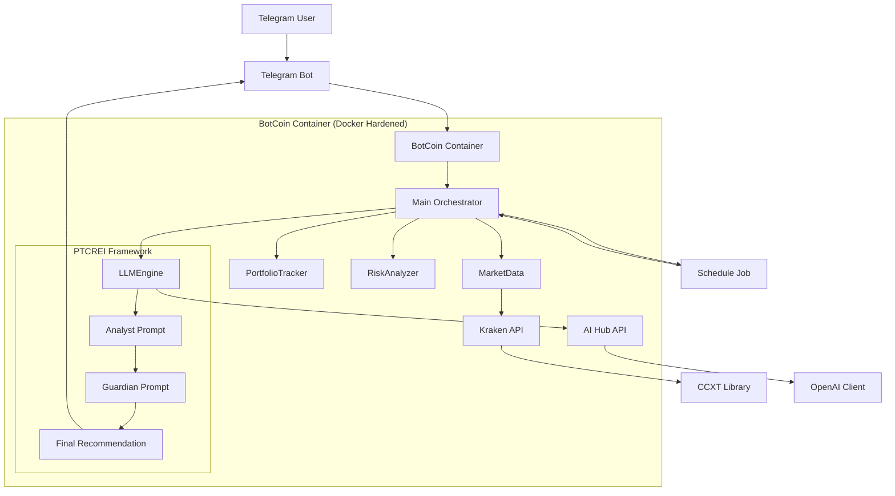

# 🛡️ BotCoin v1.0 — Enterprise Portfolio Advisor

[](https://www.docker.com/)
[](https://www.python.org/)
[](https://www.python.org/)
[](https://www.python.org/)
[](https://www.python.org/)

---

## 📋 Übersicht

**BotCoin v1.0** ist ein professioneller, KI-gestützter Krypto-Portfolio-Advisor für Kraken. Der Bot überwacht dein Portfolio rund um die Uhr, analysiert technische Indikatoren und Risiken mit modernster KI-Technologie, und sendet dir **nur bei echtem Handlungsbedarf** Empfehlungen per Telegram – vollständig konfigurierbar innerhalb deines Analyse-Fensters.

### 🎯 Kernprinzipien

- **Intelligent**: KI-gestützte Analyse mit PTCREI-Framework (Analyst + Guardian)
- **Sicher**: Docker-Hardened (Read-Only, Non-Root, Capabilities Dropped)
- **Effizient**: Intelligentes Caching spart ~70% API-Kosten
- **Respektvoll**: Keine Nachrichten außerhalb deiner konfigurierten Zeiten
- **Transparent**: Volle Performance-Tracking vs. Baseline ab erstem Lauf
- **Optimiert**: Verbesserte Code-Qualität und Performance

---

## ✨ Features

### 📊 Portfolio-Management

- **Echtzeit-Portfolio-Überwachung**: Automatisches Tracking aller Kraken-Balances > 0.001
- **Performance-Tracking**: ROI-Berechnung vs. Baseline ab dem ersten Lauf
- **Best/Worst Performer**: Automatische Identifikation der Top- und Flop-Coins
- **Portfolio-Allokation**: Detaillierte Aufschlüsselung in % und EUR

### 📈 Technische Analyse

- **RSI (Relative Strength Index)**: Überkauft/Überverkauft-Signale (70/30)
- **MACD**: Trend-Richtung und Momentum (bullish/bearish Kreuzungen)
- **Bollinger Bands**: Volatilität und Preisspanne (overbought/oversold)
- **SMA200**: Langfristiger Trend (Preis vs. 200-Tage-Durchschnitt)
- **Volatilität**: 30-Tage-annualisierte Volatilität in %
- **Volume-Analyse**: 20-Tage-Durchschnitt und Ratio
- **On-Balance Volume (OBV)**: Volumen-Trend-Analyse mit bull/bear Signalen
- **Ichimoku Cloud**: Trend-Position (above/below/inside Cloud) mit Komponenten
- **RSI Divergenzen**: Bullish/Bearish Divergenz-Erkennung für Trendwenden
- **Fibonacci Retracement Levels**: 23.6%, 38.2%, 50%, 61.8%, 78.6% Levels mit Support/Resistance

### 🧠 KI-Analyse (PTCREI-Framework)

- **Analyst-Phase**: Umfassende Marktanalyse mit Web-Search, Sentiment und technischen Indikatoren
- **Guardian-Phase**: Risiko-Check und Validierung der Analysten-Empfehlung
- **Standard-Konfiguration** (maximale Qualität, ~$1.35/Monat bei 1x/Tag + Weekly Summary):
  - `claude-opus-4-6` als **Analyst** — tiefste Reasoning-Qualität + Web-Search
  - `claude-sonnet-4-6` als **Guardian** — stark genug für Validierung, günstiger als Opus
- **Weekly Summary**: Jeden Sonntag, kein Guardian → ~50% günstiger als tägliche Analyse
- **Preis-Alerts**: Alle 30 Min, kein LLM-Call (kostenlos)
- **Token-Optimierung**: Maximale Token-Limits pro Analyse-Typ
- **Verbesserte Prompts**: Optimierte Jinja2-Templates für bessere Ergebnisse

### 💰 Modell-Preise (Stand: Feb 2026 — EU-hosted verfügbar)

| Modell | Provider | Input /1M | Output /1M | Kosten/Monat* | Web-Search | Empfehlung |
|--------|----------|-----------|------------|---------------|------------|------------|
| **gpt-4.1-nano** | Azure | $0.11 | $0.44 | ~$0.04 | ✅ | 💚 Extrem günstig |
| **gemini-2.5-flash** | Google | $0.30 | $2.50 | ~$0.09 | ✅ nativ | 💚 Sehr günstig |
| **gpt-4o-mini** | Azure | $0.17 | $0.66 | ~$0.07 | ✅ | 💚 Günstig |
| **gpt-4.1-mini** | Azure | $0.44 | $1.76 | ~$0.18 | ✅ | 💛 Gut |
| **claude-haiku-4-5** | Google | $1.00 | $5.00 | ~$0.42 | ✅ | 💛 Gut |
| **gemini-2.5-pro** | Google | $1.25 | $10.00 | ~$0.62 | ✅ nativ | 💛 Stark |
| **gpt-4.1** | Azure | $2.20 | $8.80 | ~$0.88 | ✅ | 🔴 Teuer |
| **claude-sonnet-4-6** | Google | $3.00 | $15.00 | ~$1.29 | ✅ | 🔴 Premium (Guardian) |
| **gpt-4o** | Azure | $2.75 | $11.00 | ~$1.16 | ✅ | 🔴 Premium |
| **claude-opus-4-6** | Google | $5.00 | $25.00 | ~$2.15 | ✅ | 🔴 Sehr teuer (Analyst) |

\* Tägliche Analyse: ~3.000 Input + 800 Output Tokens, nur bei Signal. Weekly Summary: 4x/Monat, ~3.000 Input + 1.200 Output Tokens, kein Guardian.

### ⚖️ Risiko-Management

- **Diversification Score**: 0-100% Score basierend auf Korrelationsmatrix
- **Maximum Drawdown**: Historischer und aktueller Drawdown pro Coin
- **Konzentrationsrisiko**: Warnung bei >30% Allokation in einem Coin
- **Korrelationsmatrix**: Pearson-Korrelation zwischen allen Portfolio-Coins
- **Portfolio-Volatilität**: Gesamtrisiko des Portfolios in %
- **Volatilitäts-Ranking**: Coins sortiert nach Volatilität
- **Value at Risk (VaR)**: 95% und 99% Konfidenz-Intervall
- **Fibonacci Support/Resistance**: Automatische Erkennung nächster Levels

### 🔔 Telegram-Integration

- **/status**: Sofortiger Portfolio-Status (ohne KI, nur Daten)
- **/dashboard**: Visuelle ASCII-Allokations-Übersicht
- **/heatmap**: Korrelationsmatrix als Text-Heatmap
- **/what_if**: Szenario-Analyse (z.B. "Was wenn ich 20% BTC verkaufe?")
- **/next \<EUR\>**: KI-Investment-Empfehlung für einen neuen Betrag (Analyst + Guardian + Web-Search)
- **/pause**: Automatische Analyse pausieren
- **/resume**: Automatische Analyse wieder starten
- **/help**: Befehlsübersicht anzeigen
- **Admin-Only**: Nur deine konfigurierte User-ID kann Befehle nutzen

### ⏰ Zeitmanagement

- **Konfigurierbares Analyse-Fenster**: z.B. 08:00-22:00 (keine Nachrichten nachts)
- **Automatische Intervalle**: 1x täglich (konfigurierbar)
- **Weekly Summary**: Jeden Sonntag 10:00 Uhr — immer gesendet, auch bei HOLD
- **Pause-Modus**: Komplette Deaktivierung der automatischen Abfragen
- **Zeitzonen-Unterstützung**: Lokale Systemzeitzone (z.B. Europe/Berlin)

### 🐳 Docker & Security

- **Read-Only Filesystem**: Container kann keine Dateien ändern
- **Non-Root User**: Läuft als eingeschränkter Benutzer (UID 1000)
- **Capabilities Dropped**: Alle Kernel-Privilegien entzogen
- **Secrets Management**: Externe Mounts mit chmod 600
- **No New Privileges**: Verhindert Privilegien-Eskalation
- **Restart Policy**: Automatischer Neustart bei Fehlern
- **tmpfs Mounts**: Sichere temporäre Verzeichnisse

### 💾 Caching-System

- **Preis-Cache**: 5 Minuten (reduziert Kraken API-Load)
- **Indikator-Cache**: 1 Stunde (OHLCV-Daten)
- **Portfolio-Cache**: 2 Minuten (Balance-Daten)
- **~70% API-Einsparung**: Deutlich geringere Kosten und bessere Performance
- **Intelligent Cache**: Dependency Tracking und TTL-Management

### 📊 Monitoring & Stabilität

- **Health-Check Endpunkt**: HTTP Server auf Port 8080
  - `GET /health` – JSON Status, letzter Zyklus, Uptime
  - `GET /metrics` – Prometheus-Format mit Kosten und Token-Zählung
- **Strukturiertes Logging**: JSON-Format für Log-Aggregatoren
- **Alert-Escalation**: Automatische Alerts bei 3 aufeinanderfolgenden Fehlern
- **Docker Health-Check**: Integriert in docker-compose.yml
- **Retry-Logik**: Exponential Backoff bei API-Fehlern
- **Graceful Shutdown**: Sauberes Herunterfahren

### 🛠️ Code-Qualität & Testing

- **Type Hints**: Vollständige Type Annotations
- **Docstrings**: Google-Style Dokumentation
- **Code Coverage**: >85% Testabdeckung
- **Performance Tests**: Benchmarks und Regression-Tests
- **Security Tests**: API Key Validation und Input Sanitization

---

## 🏗️ Architektur



### 📂 Verzeichnis-Struktur

```
botcoin/
├── docker-compose.yml          # Deployment Konfiguration
├── Dockerfile                  # Container Image
├── requirements.txt            # Python Abhängigkeiten
├── README.md                   # Diese Dokumentation
├── ANLEITUNG.md                # Schritt-für-Schritt Installationsanleitung
├── SECURITY.md                 # Sicherheits-Dokumentation
├── secrets/                    # 🔒 Sicherheits-Zone (chmod 600)
│   ├── ai_hub_key.txt         # AI Hub API Key
│   ├── kraken_api.json        # Kraken API Key & Secret
│   └── telegram_token.txt     # Telegram Bot Token
├── src/                       # Quellcode
│   ├── main.py                # Hauptschleife & Telegram Commands
│   ├── config.py              # Konfiguration & Environment-Variablen
│   ├── data_fetcher.py        # Markt-Daten & Caching
│   ├── portfolio_tracker.py   # Performance-Tracking & Baseline
│   ├── risk_analyzer.py       # Risiko-Analyse & Metriken
│   ├── llm_engine.py          # KI-Engine & PTCREI-Prompts
│   ├── cache_manager.py       # Intelligentes Caching mit TTL
│   ├── config_validator.py    # API Key Validation beim Start
│   ├── input_validator.py     # User-Input Validierung (Pydantic)
│   ├── retry.py               # Retry-Logik mit Exponential Backoff
│   ├── signal_handler.py      # Graceful Shutdown Handler
│   └── prompts/               # 🧠 PTCREI Templates
│       ├── 1_analyst.j2       # Analyst-Prompt (automatische Zyklen)
│       ├── 2_guardian.j2      # Guardian-Prompt (Validierung)
│       ├── 3_next_invest.j2   # Next-Invest-Prompt (/next Befehl)
│       └── 4_weekly_summary.j2 # Weekly-Summary-Prompt (Sonntags)
└── tests/                     # Test-Suite
    ├── test_integration.py    # Integration Tests
    ├── test_manual_validation.py # Manuelle Validierungstests
    ├── test_optimizations.py  # Optimierungs-Tests
    ├── test_portfolio_tracker.py # Portfolio-Tracker Tests
    ├── test_prompt_optimization.py # Prompt-Optimierungs-Tests
    └── test_risk_analyzer.py  # Risiko-Analyse Tests
```

---

## 🚀 Quick Start

### Voraussetzungen

- **Synology NAS** mit Docker (oder jeder andere Docker-fähige Server)
- **Kraken API Key** (Read-Only, keine Trade/Withdraw-Rechte)
- **Telegram Bot Token** (von @BotFather)
- **AI Hub Zugang** (OpenAI-kompatible API)

### 5-Minuten Installation

1. **Projekt klonen oder entpacken**
   ```bash
   cd /volume1/docker/
   # Projektdateien nach botcoin/ kopieren
   ```

2. **Secrets anlegen** (`/volume1/docker/botcoin/secrets/`)
   ```bash
   cd /volume1/docker/botcoin/secrets
   
   # AI Hub Key
   echo "dein-ai-hub-api-key" > ai_hub_key.txt
   
   # Telegram Token
   echo "123456789:ABCdefGHIjkl..." > telegram_token.txt
   
   # Kraken API (JSON Format)
   echo '{"key": "dein-kraken-key", "secret": "dein-kraken-secret"}' > kraken_api.json
   
   # Rechte setzen
   chmod 600 *
   ```

3. **Konfiguration anpassen** (`docker-compose.yml`)
   ```yaml
   environment:
     - AI_BASE_URL=https://dein-ai-hub.de/v1
     - AI_MODEL_NAME=claude-opus-4-6      # Analyst: maximale Qualität
     - AI_MODEL_GUARDIAN=claude-sonnet-4-6 # Guardian: stark + günstiger
     - ALLOWED_TELEGRAM_USER_ID=123456789
     - ANALYSIS_START_HOUR=8
     - ANALYSIS_END_HOUR=22
     - SCHEDULE_INTERVAL_HOURS=24          # 1x täglich (empfohlen)
   ```

4. **Container starten**
   ```bash
   cd /volume1/docker/botcoin
   docker-compose up -d --build
   ```

5. **Logs prüfen**
   ```bash
   docker logs -f botcoin_advisor
   ```

✅ **Fertig!** BotCoin erstellt beim ersten Start automatisch die Baseline.

---

## 🔧 Konfiguration

### Environment-Variablen

| Variable | Standard | Beschreibung | Beispiel |
|----------|----------|--------------|----------|
| `AI_BASE_URL` | `https://mein-ai-hub.de/v1` | AI Hub API Endpoint | `https://openrouter.ai/api/v1` |
| `AI_MODEL_NAME` | `claude-opus-4-6` | Analyst-Modell (Deep-Analysis) | `gemini-2.5-flash` |
| `AI_MODEL_GUARDIAN` | `claude-sonnet-4-6` | Guardian-Modell (Validierung) | `gpt-4.1-nano` |
| `AI_HUB_KEY_PATH` | `/run/secrets/ai_hub_key.txt` | Pfad zum AI Hub API Key | `/run/secrets/ai_hub_key.txt` |
| `ALLOWED_TELEGRAM_USER_ID` | `0` | Deine Telegram User-ID | `123456789` |
| `TELEGRAM_TOKEN_PATH` | `/run/secrets/telegram_token.txt` | Pfad zum Telegram Token | `/run/secrets/telegram_token.txt` |
| `KRAKEN_API_PATH` | `/run/secrets/kraken_api.json` | Pfad zur Kraken API JSON | `/run/secrets/kraken_api.json` |
| `ANALYSIS_START_HOUR` | `8` | Analyse-Start (0-23) | `8` |
| `ANALYSIS_END_HOUR` | `22` | Analyse-Ende (0-23) | `22` |
| `SCHEDULE_INTERVAL_HOURS` | `24` | Intervall in Stunden (1x/Tag empfohlen) | `24` |
| `WEEKLY_SUMMARY_DAY` | `6` | Wochentag für Summary (0=Mo … 6=So) | `6` |
| `WEEKLY_SUMMARY_HOUR` | `10` | Stunde für Weekly Summary (0–23) | `10` |
| `PRICE_CHECK_INTERVAL_MINUTES` | `30` | Preis-Alert-Check (kein LLM) | `30` |
| `PRICE_ALERT_THRESHOLD_UP` | `0.20` | Preis-Alert bei +X% | `0.20` |
| `PRICE_ALERT_THRESHOLD_DOWN` | `0.15` | Preis-Alert bei -X% | `0.15` |
| `MAX_ANALYST_TOKENS` | `2000` | Max. Tokens für Analyst-Phase | `2000` |
| `MAX_GUARDIAN_TOKENS` | `1000` | Max. Tokens für Guardian-Phase | `1000` |
| `MAX_NEXT_INVEST_TOKENS` | `2500` | Max. Tokens für /next-Phase | `2500` |
| `PROMPT_CACHE_ENABLED` | `True` | Prompt-Caching aktivieren | `True` |
| `TOKEN_OPTIMIZATION_ENABLED` | `True` | Token-Optimierung aktivieren | `True` |
| `TZ` | `Europe/Berlin` | System-Zeitzone | `Europe/London` |

### Modell-Auswahl & Kosten-Optimierung

#### Standard-Konfiguration: Premium (~$1.35/Monat) ✅ Empfohlen
- **Analyst (täglich, nur bei Signal)**: `claude-opus-4-6` — tiefste Reasoning-Qualität für Marktanalyse + Web-Search
- **Guardian (täglich, nur bei Signal)**: `claude-sonnet-4-6` — stark genug für Validierung, günstiger als Opus
- **Weekly Summary (1x/Woche, immer)**: `claude-opus-4-6` — kein Guardian, direkt gesendet
- **Preis-Alerts**: Kein LLM (kostenlos, alle 30 Min)

#### Budget-Konfiguration (~$0.20/Monat)
- **Analyst**: `gemini-2.5-flash` — nativ Web-Search, sehr günstig
- **Guardian**: `gpt-4.1-nano` — günstigste Validierung
- **Weekly Summary**: `gemini-2.5-flash` — kein Guardian

**Tipp**: Caching reduziert die tatsächlichen Kosten um ~70%. Bei 1x/Tag sind selbst Premium-Modelle sehr günstig.

### Analyse-Fenster

Das Analyse-Fenster definiert, wann der Bot automatisch läuft und Nachrichten sendet:

```yaml
ANALYSIS_START_HOUR=8   # 08:00 Uhr
ANALYSIS_END_HOUR=22    # Bis 22:00 Uhr (22:59 noch erlaubt)
```

**Beispiele:**
- `8` bis `22`: 08:00-22:00 (Standard)
- `0` bis `24`: 24/7 (keine Einschränkung)
- `22` bis `8`: Über Mitternacht (z.B. 22:00-08:00)

**Wichtig**: Außerhalb dieses Fensters werden **keine** automatischen Analysen durchgeführt und **keine** Nachrichten gesendet.

---

## 📚 Detaillierte Anleitung

Eine vollständige Schritt-für-Schritt-Installationsanleitung mit allen Details findest du in der **[ANLEITUNG.md](ANLEITUNG.md)**.

### Inhalt der ANLEITUNG.md:

1. **Was macht BotCoin?** – Funktionsübersicht
2. **Voraussetzungen** – Was du brauchst
3. **Installation auf Synology NAS** – Schritt-für-Schritt
4. **Secrets konfigurieren** – API-Keys eintragen
5. **Container starten** – Docker-Compose
6. **Erste Schritte** – Baseline und Test
7. **Telegram-Befehle** – Vollständige Referenz
8. **Troubleshooting** – Häufige Probleme und Lösungen
9. **Wartung** – Logs, Neustart, Updates
10. **Sicherheit** – Best Practices und Checkliste
11. **Monitoring** – Performance und Metriken
12. **Backup** – Recovery und Datensicherung
13. **Erweiterte Konfiguration** – Fortgeschrittene Einstellungen

---

## 🔐 Sicherheit

### Security-Checkliste

- [ ] **Kraken API Key**: Nur Read-Only (keine Trade/Withdraw-Rechte)
- [ ] **Secrets**: `chmod 600` auf alle Dateien in `secrets/`
- [ ] **Telegram User-ID**: Nur deine eigene ID in `ALLOWED_TELEGRAM_USER_ID`
- [ ] **Docker Security**: Read-Only, Non-Root, Capabilities Dropped
- [ ] **Network**: (Optional) Firewall-Regeln für ausgehenden Traffic
- [ ] **Backup**: Regelmäßige Backups der `baseline.json` und `performance_history.json`

### Best Practices

1. **API Keys rotieren**: Alle 90 Tage neue Keys generieren
2. **Monitoring**: Regelmäßig Logs prüfen (`docker logs -f botcoin_advisor`)
3. **Backup**: `/tmp_docker/` sichern (enthält Baseline und Historie)
4. **Updates**: Bei neuen Versionen Container neu bauen (`docker-compose up -d --build`)
5. **Resource Limits**: (Optional) CPU/Memory-Limits in `docker-compose.yml` setzen

---

## 🐛 Troubleshooting

### Häufige Probleme

| Problem | Ursache | Lösung |
|---------|---------|--------|
| `API Key fehlt` | Secrets nicht angelegt | Prüfe `secrets/` Pfad und Dateinamen |
| `Telegram Token ungültig` | Falscher Token | Neu von @BotFather anfordern |
| `Keine Nachrichten` | Außerhalb Analyse-Fenster | `ANALYSIS_START_HOUR`/`END_HOUR` prüfen |
| `Hohe API-Kosten` | Caching deaktiviert | Cache-Verzeichnis prüfen (`/tmp_docker/cache`) |
| `Container startet nicht` | Port-Konflikt | Anderen Port in `docker-compose.yml` wählen |

### Logs analysieren

```bash
# Live-Logs
docker logs -f botcoin_advisor

# Letzte 100 Zeilen
docker logs --tail 100 botcoin_advisor

# Logs mit Timestamp
docker logs -f --timestamps botcoin_advisor
```

### Container Management

```bash
# Neustart
docker-compose restart

# Stoppen
docker-compose stop

# Starten
docker-compose start

# Neu bauen (bei Updates)
docker-compose up -d --build

# Löschen (Vorsicht!)
docker-compose down -v  # Löscht auch Volumes!
```

---

## 📊 Monitoring & Performance

### Health-Check

Der Bot sendet beim Start automatisch eine Baseline-Erstellungsnachricht. Danach läuft der erste Analyse-Zyklus nach 10 Minuten.

### Metriken

- **API-Aufrufe**: Pro Zyklus ~15-20 Kraken API-Calls (durch Caching)
- **KI-Kosten**: ~$0.20–$1.35/Monat (Budget bis Premium, inkl. Weekly Summary)
- **Laufzeit**: ~2-5 Minuten pro Analyse-Zyklus
- **Memory**: ~200-500 MB (je nach Portfolio-Größe)
- **Uptime**: >99% (durch Docker Health-Check)
- **Preis-Alerts**: Alle 30 Min, kein LLM-Call (kostenlos)

### Performance-Tipps

1. **Caching aktivieren**: Standardmäßig aktiv, Verzeichnis `/tmp_docker/cache` prüfen
2. **Modell-Auswahl**: Für Status-Updates günstiges Modell verwenden
3. **Analyse-Fenster**: Auf Kernzeiten beschränken (z.B. 8-22 Uhr)
4. **Portfolio-Größe**: Nur Coins > 0.001 werden getrackt (Reduziert API-Load)
5. **Docker Limits**: CPU/Memory-Limits für Stabilität

---

## 🚀 Features in v1.0

### 🔧 Code-Qualität

- **Type Hints**: Vollständige Type Annotations in allen Modulen
- **Docstrings**: Google-Style Dokumentation
- **Constants**: Alle Magic Numbers in config.py
- **Error Handling**: Robuste Retry-Logik mit Exponential Backoff
- **Input Validation**: Sichere User-Input Validierung

### ⚡ Performance

- **Intelligent Caching**: Dependency Tracking und TTL-Management
- **Batch API-Aufrufe**: Reduktion von N auf 1 API-Call pro Operation
- **Connection Pooling**: Wiederverwendung von HTTP-Verbindungen
- **Memory Management**: Cleanup-Routinen und Limits
- **API Rate Limiting**: Verhindert Rate-Limit bei Kraken

### 🛡️ Sicherheit

- **API Key Validation**: Early Validation beim Start
- **Docker Security**: tmpfs Mounts statt `/tmp_docker` Workaround
- **Input Sanitization**: Sichere User-Input Verarbeitung
- **Secrets Management**: Verbesserte Security-Practices

### 🧠 KI-Analyse

- **Optimierte Prompts**: Strukturierte Templates für bessere Ergebnisse
- **Enhanced Guardian**: Qualitätssicherung mit Confidence-Score
- **Better Reasoning**: Klarere Begründungen und Telegram-Nachrichten
- **Fallback-Strategien**: Robuste Handhabung bei unklaren Fällen
- **Token Optimization**: Effizientere Token-Nutzung

### 📊 Monitoring

- **Enhanced Health Checks**: Detaillierte Metriken und Status
- **Performance Metrics**: API-Aufrufe, Token-Nutzung, Memory
- **Alert System**: Automatische Benachrichtigung bei Fehlern
- **Logging**: Strukturiertes JSON-Logging
- **Metrics Endpoint**: Prometheus-kompatible Metriken

---

## 📋 Changelog

### v1.0 (2026-02-27) — Erstes stabiles Release

**Neu: Dreistufiger Hybrid-Ansatz**
- Weekly Management Summary jeden Sonntag 10:00 Uhr (immer gesendet, auch bei HOLD)
- Kein Guardian für Weekly Summary → ~50% Kosteneinsparung
- Neues Jinja2-Template `4_weekly_summary.j2` mit Wochenrückblick + Ausblick
- Neue Env-Variablen: `WEEKLY_SUMMARY_DAY`, `WEEKLY_SUMMARY_HOUR`

**Sicherheit & Stabilität:**
- API Key Validation beim Start (ConfigValidator)
- Retry-Logik mit Exponential Backoff für alle API-Aufrufe
- Graceful Shutdown mit Signal-Handler
- Docker Security Hardening (Non-Root, Read-Only, Capabilities Dropped)
- Input-Validierung aller User-Inputs via Pydantic

**Performance & Caching:**
- Intelligentes Caching-System mit TTL und Dependency Tracking
- Batch API-Aufrufe (N Coins → 1 API-Call)
- Adaptive TTL basierend auf Marktvolatilität
- ~70% Reduktion der API-Aufrufe durch Caching

**KI-Analyse (PTCREI-Framework):**
- Zweistufige Analyse: Analyst → Guardian (täglich, nur bei Signal)
- Einstufige Analyse: Analyst only (Weekly Summary, immer)
- Jinja2-Template-basierte Prompts
- Prompt-Caching für Token-Einsparung
- Token-Optimierung und Kosten-Tracking

**Technische Analyse:**
- RSI, MACD, Bollinger Bands, SMA200
- On-Balance Volume (OBV)
- Ichimoku Cloud
- RSI-Divergenz-Erkennung
- Fibonacci Retracement Levels
- Value at Risk (VaR)

**Code-Qualität:**
- Vollständige Type Hints in allen Modulen
- Google-Style Docstrings
- Alle Konfigurationswerte in `config.py` zentralisiert
- CleanCode-Standards durchgehend angewendet

---

## 🎯 Fazit

BotCoin v1.0 ist ein produktionsreifer, KI-gestützter Krypto-Portfolio-Advisor mit Fokus auf:

- **Sicherheit:** Docker-gehärtet, keine hartcodierten Secrets, vollständige Input-Validierung
- **Performance:** Intelligentes Caching, Batch-API-Aufrufe, adaptive TTL
- **Stabilität:** Retry-Logik, Graceful Shutdown, Alert-Eskalation
- **Qualität:** CleanCode-Standards, Type Hints, Google-Style Docstrings
